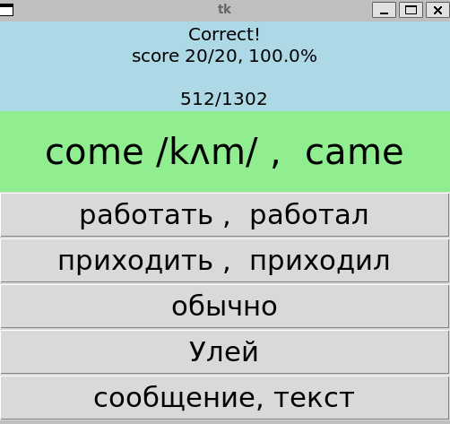
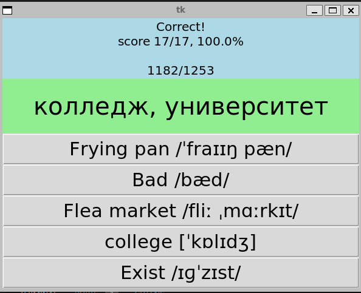
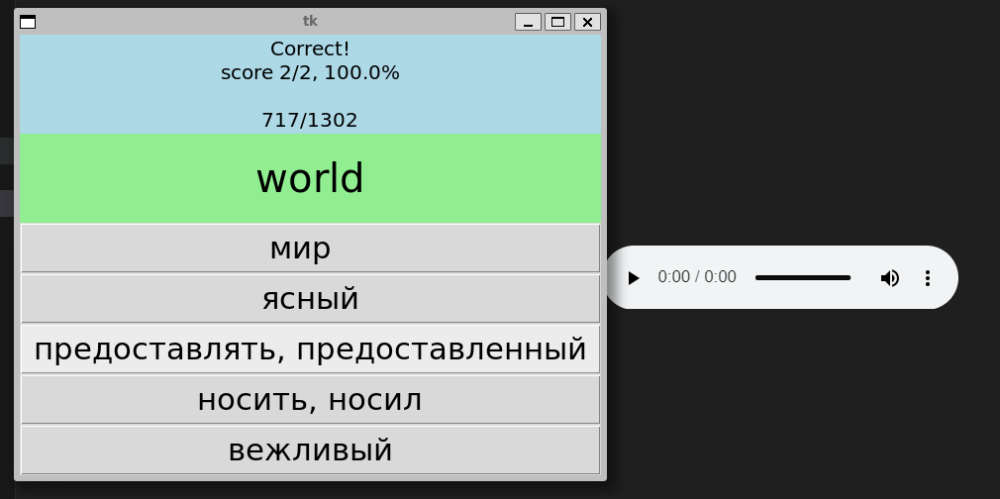

## Installation

To install the necessary packages, run the following commands:

```bash
pip install docx  # For working with Word documents in Python.
pip install gtts  # Google Text-to-Speech (gTTS) for text-to-speech conversion.
pip install pyttsx3  # A text-to-speech conversion library compatible with both Python 2 and 3.
```
To run the script:

Open the terminal.
Navigate to the directory where main.py is located.
Run the script using the command:
```bash
python main.py
```
# Usage
A simple game to learn English language (based on Russian) written in python using tkinter GUI.
The screen will display a word along with five answer options. Your task is to guess the word. The script will keep track of the number of correctly guessed words."

# Features
- English - Russian translation.

- Russian - English translation.

- Correctly guessed words.
- For each english world the gTTS -- Google Text-to-Speech package will compile a .mp3 file in the main root, and user can listen how to pronounce the word.

