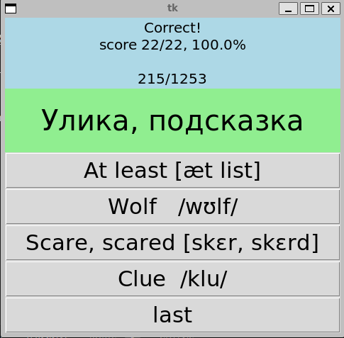

# Installation
Provide instructions on how to install or set up the project. Include prerequisites, dependencies, and steps to get the project up and running.

# Usage
Explain how to use the project. Provide code examples, configuration settings, or any other information necessary to understand and utilize the project.

# Features
List and briefly describe the main features or functionalities of the project.

# Contributing
Guidelines for those who want to contribute to the project. Include information about how to report issues, propose enhancements, or submit pull requests.

# License
Indicate the project's license and any related information.